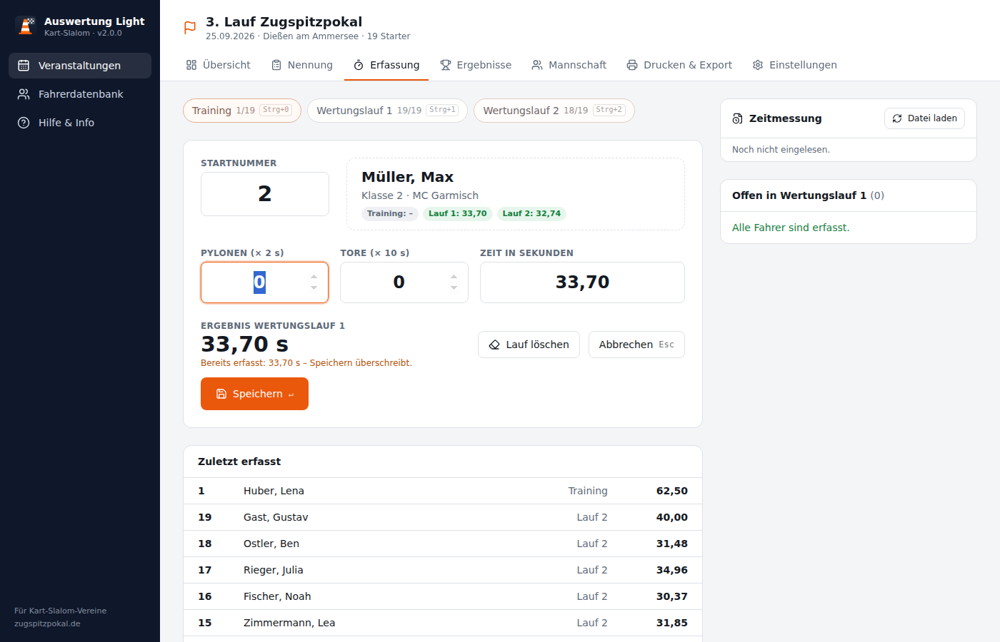
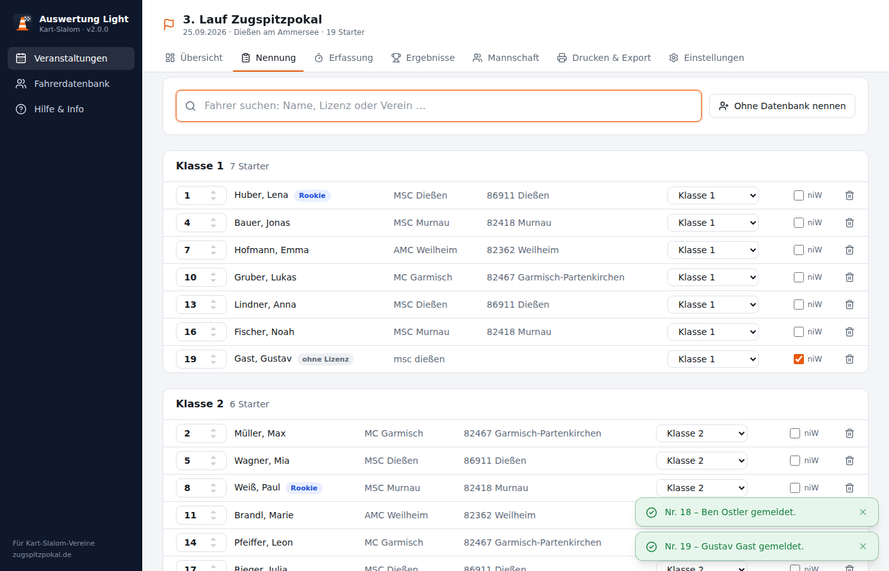
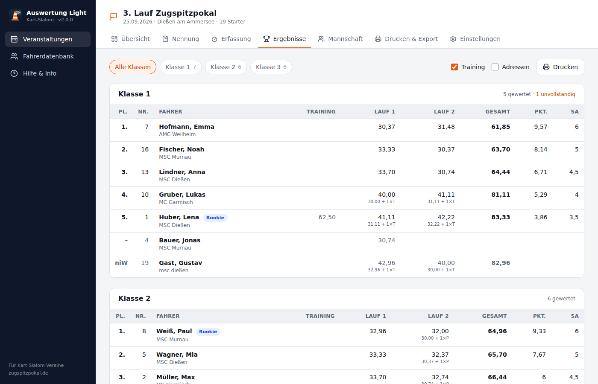
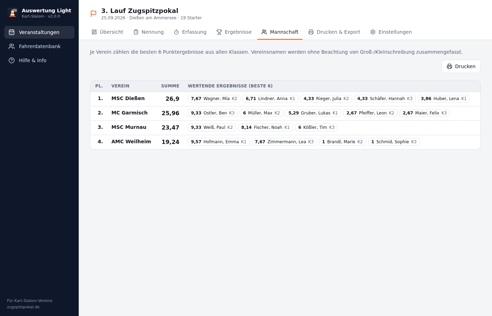

# Auswertung Light 2

**English**: Auswertung Light is a desktop app for scoring German kart slalom events (Zugspitzpokal). The documentation is in German, as the tool is intended for German kart slalom clubs.

Auswertung Light ist ein Auswertprogramm für den **Kart-Slalom**. Version 2 ist eine Neuentwicklung der bisherigen
Excel-Arbeitsmappe als **Desktop-App für Windows, macOS und Linux**. Sie arbeitet vollständig offline, sodass
am Veranstaltungsort kein Internet nötig ist.



## Funktionen

| Bereich | Was die App kann |
|---|---|
| **Fahrerdatenbank** | Import der Zugspitzpokal-Fahrerliste (CSV, UTF-8 oder Windows-1252). Vorhandene Fahrer werden abgeglichen statt überschrieben. Suche, Sortierung nach Name, Lizenz, Klasse oder Verein, Bearbeiten, CSV-Export. Anzeige, bei welchen Veranstaltungen ein Fahrer gestartet ist. |
| **Veranstaltungen** | Beliebig viele Veranstaltungen. Klassen, Strafsekunden, Logos, Ausrichter und Zeitmessung werden von der letzten Veranstaltung übernommen. |
| **Klassen** | Frei konfigurierbar (Standard: Klasse 1–6), Reihenfolge änderbar, je Klasse einstellbar, ob sie zur Mannschaftswertung zählt. |
| **Nennung** | Fahrer per Suche (Name, Lizenz, Verein) mit der Tastatur nennen. Die Klasse wird aus der Datenbank übernommen, die Startnummer vorgeschlagen. Fahrer ohne Lizenz können direkt erfasst werden. Kennzeichnung „außer Wertung" (niW). |
| **Erfassung** | Eingabemaske ganz für die Tastatur: Startnummer ↵, Fehler 1 ↵, Fehler 2 ↵, Zeit ↵. Training, Lauf 1 und Lauf 2 mit Strg + 0/1/2. Zeiten als `32,45` oder `1:02,34`. Übersicht der noch offenen Fahrer. |
| **Zeitmessung** | Übernahme von Zeiten aus der CSV- oder Excel-Datei der Zeitmessanlage. Die Datei wird beobachtet, neue Zeiten erscheinen sofort. Übernahme per Klick oder Strg + T, bereits zugeordnete Zeiten werden markiert. |
| **Ergebnisse** | Live berechnete Ergebnislisten je Klasse mit Laufzeiten, Strafen, Gesamtzeit, Punkten und ADAC-Sportabzeichenpunkten. Rookies werden markiert, Adressen lassen sich einblenden. |
| **Mannschaftswertung** | Die besten 6 Ergebnisse (einstellbar) je Verein über alle Klassen. Bei Punktgleichstand auf dem letzten zählenden Platz werden die Namen mit „&" verbunden. |
| **Drucken / PDF** | Startliste mit Notizfeldern, Ergebnisliste, Mannschaftswertung und Urkunden, jeweils mit Vereinslogos im Kopf. |
| **Export** | ZP-Format (`zp_output.csv`) für den Ergebnisdienst von zugspitzpokal.de, Ergebnisse als CSV für Excel, Sicherung und Übertragung einer Veranstaltung als JSON. |

<details>
<summary>Weitere Screenshots</summary>





</details>

## Wertungsregeln

Die Rechenregeln stammen aus den Formeln der Excel-Version (`src/lib/domain/wertung.ts`, `mannschaft.ts`):

- **Laufergebnis** = Zeit + Fehler 1 × Strafe 1 + Fehler 2 × Strafe 2 (Standard: Pylone 2 s, Tor 10 s), auf 1/100 gerundet
- **Gesamt** = Wertungslauf 1 + Wertungslauf 2. Das Training zählt nicht.
- **Reihenfolge:** Gesamtzeit, bei Gleichstand der bessere Einzellauf. Sind beide gleich, gibt es den gleichen Platz (1, 1, 3 …).
- **Punkte** = (Teilnehmer − Platz) × 10 / Teilnehmer + 1. Alle gemeldeten Fahrer der Klasse zählen als Teilnehmer.
- **Sportabzeichenpunkte:** Platz 1 = 6, Platz 2–10 = (12 − Platz) / 2, ab Platz 11 = 0,5
- **Mannschaft:** Summe der besten N Punktergebnisse je Verein

### Unterschiede zur Excel-Version

- Fahrer ohne beide Wertungsläufe werden als „unvollständig" ohne Platz geführt. Bisher rutschten sie mit 0 s nach vorne.
- Klasse 6 zählt jetzt zur Mannschaftswertung. In v0.23 fehlte sie dort.
- Vereinsnamen werden ohne Beachtung von Groß-/Kleinschreibung und doppelten Leerzeichen zusammengeführt.
- Startnummern sind je Veranstaltung eindeutig.
- Lizenznummern bleiben Text, führende Nullen gehen also nicht verloren.
- Nennungen speichern eine Kopie der Fahrerdaten. Spätere Änderungen an der Fahrerdatenbank verändern alte Ergebnisse nicht.

## ZP-Format

`zp_output.csv` hat denselben Aufbau wie das frühere Blatt „zp_output": 21 Spalten, kommagetrennt,
Dezimalpunkt, Windows-1252, ohne Kopfzeile.

`Veranstaltungs-ID, Lizenz, Verein, Startnummer, Klasse, gewertet (1/0), Training F1/F2/Zeit, Lauf 1 F1/F2/Zeit, Lauf 2 F1/F2/Zeit, Gesamt, Platz (bzw. niW), Punkte, Sportabzeichenpunkte, Name, \N`

Die Veranstaltungs-ID wird unter *Drucken & Export* oder in den Einstellungen der Veranstaltung eingetragen.

## Installation

Installationsdateien für Windows (`.msi`/`.exe`), macOS (`.dmg`) und Linux (`.deb`/`.AppImage`) entstehen
automatisch in GitHub Actions, sobald ein Versions-Tag (`v2.0.0`) gepusht wird. Sie liegen dann als Entwurf
unter *Releases*.

Die Daten liegen in der SQLite-Datei `auswertung-light.db` im App-Datenverzeichnis, unter Windows
`%APPDATA%\de.zugspitzpokal.auswertung-light`. Für einen Rechnerwechsel am besten die Veranstaltung unter
*Drucken & Export → Veranstaltung sichern* exportieren und auf der Startseite wieder importieren.

## Entwicklung

Voraussetzungen: [Node.js](https://nodejs.org) ≥ 20, [pnpm](https://pnpm.io), [Rust](https://rustup.rs) und die
[Tauri-Systemvoraussetzungen](https://v2.tauri.app/start/prerequisites/).

```bash
pnpm install
pnpm tauri dev     # Desktop-App mit Hot Reload
pnpm dev           # nur die Oberfläche im Browser (Demo-Modus, Daten im localStorage)
pnpm test          # Unit-Tests (Wertung, Import/Export, Datenbank)
pnpm check         # Typprüfung
pnpm tauri build   # Installationspaket für das aktuelle Betriebssystem
```

### Aufbau

```
src/
├─ lib/domain/     Fachlogik als reine TypeScript-Funktionen (mit Tests)
│  ├─ wertung.ts         Laufergebnis, Rangliste, Punkte
│  ├─ mannschaft.ts      Mannschaftswertung
│  ├─ fahrer-import.ts   ZP-Fahrerliste (CSV)
│  ├─ zp-export.ts       ZP-Output
│  └─ zeitquelle.ts      Zeitmessung (CSV/XLSX)
├─ lib/db/         SQLite-Schema (Drizzle ORM), Migrationen, Repository
│                  Desktop: tauri-plugin-sql · Browser/Tests: sql.js
├─ lib/stores/     Zustand einer geöffneten Veranstaltung (Svelte 5 Runes)
├─ lib/components/ Ergebnisliste, Mannschaftsliste, Fahrersuche, Druckkopf
└─ routes/         Seiten (SvelteKit, statisch als SPA ausgeliefert)
src-tauri/         Desktop-Hülle (Rust): Plugins für SQL, Dialoge, Dateien, Drucken
legacy/            Die bisherige Excel-Version (v0.23) samt exportiertem VBA-Code
```

Schemaänderungen: `src/lib/db/schema.ts` anpassen und `pnpm db:generate` ausführen. Die neue Migration wird beim
nächsten Start automatisch angewendet.

## Team

Hauptprogramm: [Johannes Haseitl](http://derhasi.de)
Weitere Hilfe (Excel-Version): Michael Steinhoff (Zahlenformat deutsch/englisch), Dieter Schweingruber (Testing, MC Dießen)

Fragen und Fehler bitte unter https://github.com/derhasi/auswertung-light/issues melden.
Die Versionsänderungen stehen im [CHANGELOG](CHANGELOG.md).
